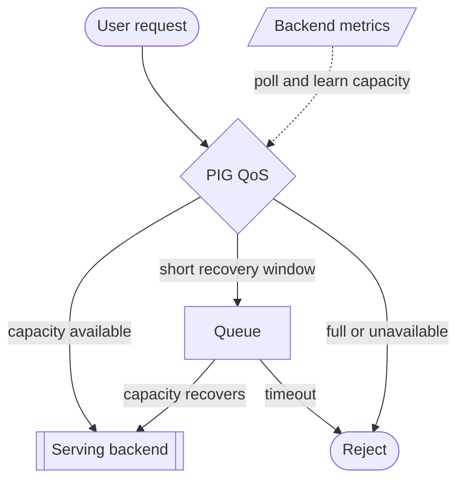

# Phala Inference Guard

Phala Inference Guard (PIG) is a lightweight QoS proxy for Phala model serving
backed by vLLM or SGLang. It sits between HAProxy and the serving backend, reads
backend metrics, and decides whether new model requests should be forwarded,
given a very short recovery window, or rejected.

This repository is the canonical source for Phala Inference Guard. Treat PIG as
a standalone Phala serving component with its own versioning, image, deployment
rules, and documentation.

PIG is designed for production model compose stacks where user-visible
generation speed matters. The default policy targets `25 tok/s/user` and treats
sustained performance below `20 tok/s/user` as degraded.

## Features

- Streams request and response bodies through the proxy path.
- Learns a dynamic global QoS cap from vLLM or SGLang load and generation
  metrics.
- Uses PIG-observed semantic streaming TTFT for TTFT cap learning when stream
  samples exist, with backend TTFT as the startup fallback. TTFT p99 acts as a
  tail-latency guard when first useful output drifts above the default `1s`
  target. Recovery probes upward gradually under representative load instead of
  jumping back to the global cap.
- Applies QoS only to new requests; existing streams continue.
- Gives trusted direct traffic priority over provider traffic through the
  lightweight `X-User-Tier` header. `premium` requests can use the full current
  cap, while `basic` requests leave one currently empty premium slot whenever
  possible and stop taking newly freed slots when premium requests are waiting.
- Rewrites backend JSON request priority from trusted `X-User-Tier` by default:
  `premium` receives `priority=-100`; `basic`, missing, or unknown tiers are
  normalized to `priority=0`.
- Reclassifies a narrow set of vLLM `500` JSON errors that are clearly caused
  by client input, such as context-length validation, tool/function argument
  JSON decoding, and multimodal image fetch/decode failures. Backend crashes,
  OOMs, and scheduler failures remain upstream `5xx`.
- Rejects overloaded requests early instead of letting queue time damage
  provider throughput metrics.
- Measures semantic streaming TTFT: the delay until the first useful SSE
  `data:` payload such as `reasoning_content`, `reasoning`, `content`, or a tool
  call delta reaches the client.
- Can add low-load SSE keep-alive comments and early bridge comments for
  streaming responses when explicitly enabled.
- Returns OpenAI-compatible HTTP 429 errors while metrics still separate QoS
  pressure from backend-unavailable failures.
- Protects `/pig/metrics` and `/v1/metrics` with
  `Authorization: Bearer $TOKEN`.
- Can protect OpenAI generation routes with the same Bearer token when `TOKEN`
  is set.
- Provides `/v1/attestation/report` as a first-class PIG endpoint.
- Collects NVIDIA GPU evidence directly through NVML on GPU deployments and
  returns the standard `nonce/evidence_list/arch` NVIDIA payload shape.

## Architecture



User requests enter the PIG QoS decision point. Backend metrics feed that
decision as a separate capacity signal, so request traffic and metrics polling
stay on different paths.

The decision has three outcomes. Requests are forwarded to the serving backend
when capacity is available, allowed only a short recovery window when pressure
may clear immediately, or rejected when capacity is full or no backend is usable.
Queued requests move to the backend if capacity recovers quickly; otherwise they
time out and are rejected.

Backend scheduler waiting is treated as a hard new-intake signal. When backend
metrics report any waiting request, PIG stops forwarding newly arriving model
requests directly to the backend, puts them through the short recovery window,
and only forwards them if the next healthy metrics polls show waiting has
cleared.

PIG learns the capacity signal by polling backend metrics and combining recent
load with generation throughput. TTFT learning prefers PIG's own semantic
streaming TTFT, meaning request arrival to the first useful SSE data written
downstream; before such stream samples exist, it falls back to backend TTFT.
The learned cap can move down when TTFT stays high, then only probes upward
after healthy samples arrive while traffic is close enough to the learned cap to
prove the backend can carry more load. That learned state is applied to future
QoS decisions.

## Project Layout

```text
cmd/phala-inference-guard/        executable entrypoint
internal/app/server/           HTTP proxy runtime, lifecycle, and component wiring
internal/app/dynamic/          dynamic metrics polling, learned caps, pressure state
internal/app/gate/             QoS acquire, tier priority, queue counters, wait/notify loop
internal/app/request/          path, body, priority rewrite, and output-token request classification
internal/config/pigconfig/     environment config loading and validation
internal/domain/capacity/      capacity learning and pressure limits
internal/domain/decision/      decision states, reasons, and limit composition
internal/domain/dynamic/       dynamic QoS policy evaluation, clean signal derivation, and stage orchestration
internal/domain/latency/       TTFT and semantic-latency learning policy
internal/domain/request/       request path, body, tier, and token classification rules
internal/domain/qos/           queue wait and prefill grace policy
internal/domain/tier/          premium/basic share and limiter policy
internal/domain/lane/          QoS lane counters and bucketed metrics state
internal/infra/                backend, HTTP, SSE, OpenAI error, env, and Prometheus adapters
internal/runtime/              backend observations, aggregation-friendly telemetry samples, dynamic snapshots, token windows, trackers
internal/observability/        histogram, status-line, and Prometheus metrics rendering
internal/support/              small pure helper packages
Dockerfile                     lean Go production image build
docs/ADVANCED.md               optional runtime knobs
docs/OBSERVABILITY.md          logs and metrics reference
docs/REQUEST_TIER_PRIORITY.md  direct/provider request priority guide
docs/WAITING_POLICY.md         backend waiting and short-wait behavior
```

The package split follows a simple rule: `app` wires requests and lifecycle,
`domain` decides limits, `runtime` stores observed state and stable telemetry
sample types, `infra` adapts outside systems such as Prometheus input and HTTP responses, and `observability`
formats logs and exported metrics. Request classification and QoS acquisition
are separate app components so the HTTP proxy runtime stays focused on request
orchestration instead of policy details.

The hot-path implementation keeps those boundaries but avoids avoidable work in
common production cases: telemetry aggregation has empty and single-backend fast
paths, request body compatibility cleanup and priority injection share one
streaming scanner with pooled buffers by default, and final limit composition
evaluates an explicit ordered component list.

## Minimal Configuration

Production dynamic QoS deployments need a serving upstream, a backend metrics
endpoint, and a token for protected PIG endpoints.

```text
UPSTREAM=http://backend:8000
DYNAMIC_METRICS_URL=http://backend:8000/metrics
TOKEN=<bearer token for PIG-protected routes>
```

With those variables, dynamic QoS is enabled and enforced. The same token also
protects `/v1/metrics`, `/v1/attestation/report`, and, by default when `TOKEN`
is set, the OpenAI generation routes controlled by PIG. By default, PIG
controls:

```text
/v1/chat/completions
/v1/completions
/v1/responses
```

## Production Compose Integration

Use the published GHCR image:

```text
ghcr.io/phala-network/phala-inference-guard:<version>
```

For local development, build the same image shape from this repository:

```sh
docker build -t phala-inference-guard:my_tag .
```

Deploy PIG as the model-serving guard between HAProxy and the serving runtime:

```text
dstack-ingress -> haproxy -> phala-inference-guard -> vLLM or SGLang
```

Keep the existing `dstack-ingress` target as `http://haproxy:80`.

### Add The PIG Service

Add this service next to the serving backend:

```yaml
services:
  phala-inference-guard:
    image: ghcr.io/phala-network/phala-inference-guard:v0.8.7
    container_name: phala-inference-guard
    restart: always
    runtime: nvidia
    privileged: true
    depends_on:
      - backend
    environment:
      - TOKEN=${TOKEN}
      - BACKENDS=backend=http://backend:8000|http://backend:8000/metrics
      - TLS_CERT_PATH=/evidences/cert-example.pem
    volumes:
      - /var/run/dstack.sock:/var/run/dstack.sock
      - /var/volatile/dstack/evidences:/evidences:ro
```

For SGLang deployments, use the SGLang service name and metrics endpoint in
`depends_on` and `BACKENDS`.

Mount `/var/run/dstack.sock` when `/v1/attestation/report` is enabled. Mount the
custom-domain certificate and set `TLS_CERT_PATH` when attestation version `2`
must bind the TLS SPKI fingerprint into `report_data`. Give the PIG container
GPU access for native evidence collection, for example `runtime: nvidia`,
and `privileged: true`. The image defaults `NVIDIA_VISIBLE_DEVICES=all`, so
production compose files usually do not need to repeat it. PIG collects NVIDIA
evidence itself through the NVML library injected by the NVIDIA runtime. Missing
GPU evidence fails closed by default; local or test deployments that
intentionally run without GPU evidence must set
`ATTESTATION_REQUIRE_NVIDIA_EVIDENCE=false` explicitly.

`ATTESTATION_NVIDIA_PAYLOAD`, `ATTESTATION_NVIDIA_PAYLOAD_FILE`,
`ATTESTATION_NVIDIA_PAYLOAD_URL`, and `ATTESTATION_NVIDIA_COMMAND` remain
available as explicit override or fallback sources. They are not required for
normal GPU deployments.

### Point HAProxy At PIG

Make HAProxy depend on `phala-inference-guard`:

```yaml
services:
  haproxy:
    depends_on:
      - phala-inference-guard
```

Point the model backend at PIG:

```haproxy
server model phala-inference-guard:8000 check maxconn 512
```

Set HAProxy `maxconn` high enough that it does not become the primary limiter;
PIG should make the QoS decision. The example uses `512` as a conservative
starting point.

Also review the backend runtime concurrency limits, such as vLLM
`--max-num-seqs` or the equivalent SGLang setting. They should usually be raised
high enough that PIG, rather than the backend runtime, makes the first QoS
decision.

Route `/v1/attestation/report` to PIG when attestation is enabled.

### Mark Request Tier

PIG reads only the `X-User-Tier` request header for tier priority. It treats
`premium` as direct traffic and treats `basic`, missing, or unknown values as
provider traffic. The check is intentionally lightweight: PIG does not parse the
request body for tier selection. If multiple `X-User-Tier` headers are present,
PIG treats the request as `basic`.

PIG also injects backend JSON request priority after a request passes QoS
admission. The mapping uses lower number means higher backend priority:

```text
X-User-Tier: premium -> "priority": -100
X-User-Tier: basic   -> "priority": 0
missing or unknown   -> "priority": 0
```

`BACKEND_PRIORITY_MODE=all` is the default because OpenAI compatibility cleanup
already scans eligible admitted JSON request bodies. Keeping priority
normalization in the same streaming pass neutralizes client-supplied body
priority without adding another body read. Set `BACKEND_PRIORITY_MODE=premium_only`
only when basic/provider request bodies must be left unchanged. Backend priority
requires the runtime to have compatible priority scheduling enabled; otherwise
the field is simply forwarded as part of the OpenAI-compatible JSON request.
By default, PIG forwards admitted requests when backend priority cannot be
normalized because the body is oversized, unknown-length, non-JSON, malformed,
or the rewrite slots are busy. Known-length bodies that fit within
`BACKEND_PRIORITY_STREAM_BUFFER_BYTES` are safety-buffered, so rewrite failures
restore the original body. Larger bodies keep the optimized streaming path to
avoid unbounded memory growth. Set `BACKEND_PRIORITY_FAIL_OPEN=false` for strict
deployments that prefer rejecting those requests.

Set this header only at a trusted gateway or HAProxy layer. Remove any client
supplied value before setting the tier:

```haproxy
http-request del-header X-User-Tier
http-request set-header X-User-Tier basic
```

For direct-only routes, set:

```haproxy
http-request del-header X-User-Tier
http-request set-header X-User-Tier premium
```

Do not let public clients choose this header directly.

### Upstream Input Error Classification

PIG keeps upstream response bodies intact by default except for a narrow
OpenAI-compatible error normalization path. When vLLM returns HTTP `500` with a
JSON error body that clearly describes a client input problem, PIG changes the
HTTP status and the JSON `error.type`/`error.code` to a client error:

```text
context length exceeded                 -> 400 BadRequestError
VLLMValidationError                     -> 400 BadRequestError
tool/function argument JSON decode      -> 400 BadRequestError
image URL 403, DNS/fetch, decode errors -> 422 UnprocessableEntityError
```

This is enabled by default through `UPSTREAM_ERROR_CLASSIFICATION_ENABLED=true`.
It does not rewrite broad `5xx` failures. Backend crashes, OOMs, scheduler
exceptions, non-JSON error pages, and oversized error bodies are passed through
with the original upstream status and body.

### Route PIG Metrics

If HAProxy exposes protected metrics routes, add a PIG metrics route:

```haproxy
frontend http_frontend
    acl is_pig_metrics path /pig/metrics
    acl is_authorized hdr(Authorization) -m str "Bearer ${TOKEN}"
    http-request deny if is_pig_metrics !is_authorized
    use_backend pig_metrics_backend if is_pig_metrics

backend pig_metrics_backend
    mode http
    server pig phala-inference-guard:8000 check maxconn 32
```

PIG also serves `/v1/metrics` as the combined serving-chain metrics endpoint. It returns PIG local
metrics followed by backend metrics fetched from the configured backend metrics
URLs. If backend metrics cannot be fetched, the endpoint still returns HTTP 200
with a Prometheus comment describing the failure.

## Failure Semantics

PIG protects provider-facing performance by keeping queue waits short,
returning OpenAI-compatible 429 errors when QoS capacity is full or no backend is
usable. This favors fast successful requests and early overload signals over
slow queued successes.

PIG-generated failure bodies use an OpenAI-compatible error shape:

```json
{"error":{"message":"Too many requests","type":"TooManyRequestsError","param":null,"code":429}}
```

The internal PIG reason is not exposed in the HTTP response. It stays in the
protected QoS metrics and process status logs.

SSE comment injection is disabled by default. When explicitly enabled, PIG may
add keep-alive comments to `200 text/event-stream` responses while backend load
is green and idle. With a separate explicit switch, accepted provider requests
with `Accept: text/event-stream` can also receive an early SSE comment after a
short built-in grace window when upstream headers have not arrived yet. That can
lower provider fetch latency during long prefill gaps without inspecting or
buffering non-streaming request bodies.

For accepted `200 text/event-stream` responses, PIG also records semantic TTFT:
the time from PIG request arrival until the first useful SSE `data:` payload is
written downstream. It ignores headers, empty data, `[DONE]`, SSE comments, and
PIG keep-alive comments, so this metric is closer to what an OpenAI-compatible
streaming client actually sees than backend `time_to_first_token_seconds` or
proxy first-byte latency. When dynamic TTFT protection is enabled, PIG uses this
semantic metric as the preferred TTFT learning source after it has observed
stream samples.

Fast upstream errors still keep their original HTTP status. If an upstream
connection fails after PIG has already opened an early SSE bridge, PIG records
that path in protected metrics instead of exposing internal reasons to the
client.

## Documentation

- [ADVANCED.md](docs/ADVANCED.md): optional environment variables and tuning knobs.
- [PIG_INTERNAL_COMPONENT_ALGORITHM_FLOW.md](docs/PIG_INTERNAL_COMPONENT_ALGORITHM_FLOW.md):
  flowcharts for PIG internal request admission, dynamic QoS learning, and final
  cap composition.
- [OBSERVABILITY.md](docs/OBSERVABILITY.md): logs, metrics, and production checks.
- [REQUEST_TIER_PRIORITY.md](docs/REQUEST_TIER_PRIORITY.md): `X-User-Tier`
  priority behavior for direct and provider traffic.

## License

This project is licensed under the [GNU General Public License v3.0](LICENSE).
