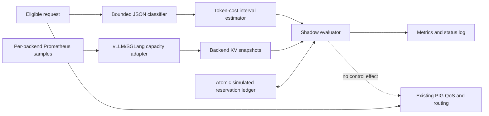

# PIG v0.9.0 Backend-Aware KV Admission Shadow Plan

Status: implementation and simulation plan  
Version target: `PIG-v0.9.0`  
Release mode: `off` or `shadow` only  
Production deployment: explicitly out of scope

## 1. Goal

PIG v0.9.0 will add a backend-aware, token-aware KV admission model that can
answer a counterfactual question for every eligible request:

> Given the latest backend-specific KV capacity, active KV tokens, recent
> preemption state, and this request's conservative token-cost interval, would
> a token-budget policy have admitted the request without crossing the backend's
> protected KV budget?

The answer is recorded only. v0.9.0 must not reject, delay, reroute, mutate, or
otherwise change a client request because of the KV shadow decision. Existing
PIG QoS and backend selection remain authoritative.

The purpose of this version is to produce enough deterministic simulation and
online shadow evidence to decide whether a later v0.9.x release can safely use
token budgets to fill more KV capacity than the current request-count and
sampled-percentage feedback loop while reducing blind-window overshoot.

## 2. Evidence and problem statement

Read-only inspection of the six target CVMs established two distinct backend
capacity models:

| CVM | Runtime | Capacity source | Observed risk signal |
|---|---|---|---|
| `bf47b91b-77f9-44ab-a081-284268e205f7` | vLLM | `kv_cache_size_tokens=862437` | KV max `0.991`, preemptions increased |
| `6e775a03-c7e2-496b-9c6b-76d17d89ca12` | vLLM | `kv_cache_size_tokens=862437` | KV max `0.996`, preemptions increased |
| `a0f0bfb3-e46f-4b22-814e-24872f251193` | vLLM | `kv_cache_size_tokens=862437` | KV max `0.983`, preemptions increased |
| `d4c268f5-b537-4b5e-969f-784432250f7c` | SGLang | `max_total_num_tokens=1041408` | KV max about `0.98`; historical EAGLE workspace OOM risk |
| `55f52ee5-813c-4c25-b92a-4d3ca2de39c2` | SGLang | `max_total_num_tokens=1041408` | KV max about `0.91` |
| `6193464a-a31a-4bab-8284-9b64d326a848` | SGLang | `max_total_num_tokens=1041408` | KV max about `0.98` |

The current dynamic algorithm reacts after Prometheus polling. At a 500 ms or
1 s interval, a same-window burst of long prompts can be admitted before the
next sampled KV percentage reflects their prefill allocations. Request counts
cannot distinguish dozens of short prompts from a small number of 64k/128k
prompts. This creates both under-use and overshoot:

- a conservative count cap wastes KV when requests are short;
- an aggressive count cap can cross the red KV threshold on a long-prompt
  burst before the next metrics poll;
- a single maximum KV percentage loses per-backend fit information;
- SGLang radix-cache tokens that are evictable must not be treated as active
  admission pressure;
- SGLang EAGLE/DeepGEMM can still need non-KV workspace, so even correct token
  accounting cannot justify using 100% of reported KV capacity.

## 3. Version scope and safety boundary

### 3.1 Supported modes

`KV_ADMISSION_MODE=off`

- No request body work or shadow reservation work is performed for KV
  admission.
- Existing PIG behavior is unchanged.

`KV_ADMISSION_MODE=shadow`

- PIG computes and records a hypothetical decision.
- A simulated reservation is created only when the hypothetical policy says
  `fit`.
- The reservation is released on request rejection by the existing policy,
  response completion, cancellation, or timeout reconciliation.
- The real request continues through the existing PIG path regardless of the
  shadow result.

Any other value, including `enforce`, is a startup validation error in v0.9.0.
This structural gate prevents an accidental environment change from turning
the unvalidated model into a production admission controller.

### 3.2 Explicit non-goals

v0.9.0 does not:

- enforce a KV decision;
- change current QoS limits, queue waits, backend scoring, or routing;
- call backend `/tokenize` in the request hot path;
- embed or copy a model tokenizer or chat template into PIG;
- claim exact token counts for text, tools, multimodal input, or templates;
- eliminate SGLang speculative-decoding workspace risk;
- deploy to, restart, or edit Compose on any production CVM.

## 4. Why v0.9.0 does not add an exact tokenizer

The public backend `/tokenize` path returns token-id arrays and has shown
hundreds of milliseconds of additional request latency. Calling it also adds a
new backend dependency precisely when the backend is under pressure. Copying a
tokenizer and chat template into Go PIG would introduce model-version drift and
would still be fragile for tools, response schemas, and multimodal requests.

v0.9.0 therefore uses a conservative bounded interval:

```text
estimated_input_low <= actual_input_tokens <= estimated_input_high
```

The estimator uses only bounded local JSON classification already needed by
PIG. A future release may use an exact tokenizer only if the serving runtime
provides a count-only endpoint with measured low tail latency and model/chat
template equivalence.

## 5. Architecture



The implementation is separated into four layers:

1. `internal/infra/prometheus` parses runtime-specific capacity metrics.
2. `internal/domain/kvadmission` owns portable types, estimator math, budgets,
   and decision semantics.
3. `internal/runtime/kvshadow` owns the concurrency-safe reservation lifecycle,
   reconciliation, counters, and snapshots.
4. `cmd/pig-kv-sim` and `internal/simulation/kv` replay deterministic JSONL
   traces against the same domain/runtime code used by PIG.

## 6. Backend metric semantics

Every backend retains its own snapshot. Multi-backend data is never collapsed
into a single maximum for KV shadow decisions.

Required snapshot fields are:

```text
BackendName
BackendKind
KVCapacityTokens
KVUsedTokens
KVAvailableTokens
KVEvictableTokens
KVUsage
SampleTimestamp
SampleAge
GenerationTokens
GenerationTPS
Waiting
PreemptionDelta
Failed
```

### 6.1 vLLM

- Backend kind is detected by the presence of vLLM metrics.
- Capacity comes from the `kv_cache_size_tokens` label on
  `vllm:cache_config_info`.
- This label is authoritative for hybrid/group-aware caches. PIG must not
  derive capacity from `num_gpu_blocks * block_size`.
- Used tokens are `round(capacity * vllm:kv_cache_usage_perc)`.
- Available tokens are `capacity - used`.

### 6.2 SGLang

- Backend kind is detected by the presence of SGLang metrics.
- Capacity comes from `sglang:max_total_num_tokens`.
- TP-rank series are duplicate views of one logical pool and are deduplicated
  with `max`; they are never summed.
- Available, evictable, and used series are also deduplicated with `max`.
- Active pressure is cross-checked with:

  ```text
  active_identity = capacity - available - evictable
  ```

- If a reported used metric includes evictable radix-cache entries, the
  identity above is used so reusable cache does not falsely close admission.
- If token metrics are incomplete, the adapter may expose percentage usage for
  legacy QoS but marks token capacity invalid for shadow admission.

## 7. Request-cost interval

For supported JSON requests, the estimator records:

```text
body_bytes
text_bytes
tool_schema_bytes
message_count
tool_count
modality_count
max_output_tokens_if_present
estimated_input_low
estimated_input_high
bounded_decode_allowance
```

The default interval uses configurable model-family-safe bounds:

```text
low_text  = ceil(text_bytes / max_bytes_per_token)
high_text = ceil(text_bytes / min_bytes_per_token)

template_low/high = message_count * template_tokens_per_message_low/high
tool_low/high     = tool_schema_bytes converted with tool byte/token bounds
modality_low/high = modality_count * modality token bounds

input_low/high = text + template + tools + modalities + bounded residual
```

The upper estimate is never lower than a conservative whole-body byte/token
bound. This catches unrecognized schemas without recursively interpreting every
field.

The projected request cost adds a bounded output blind-window allowance, not
the full requested `max_tokens`. Full output reservation would strand capacity
for long streams whose tokens are allocated incrementally. Decode drift across
all active requests is protected separately from the new-request allowance.

Malformed JSON, unknown-length bodies, bodies larger than the configured scan
bound, and unsupported content types produce `unsupported_request`. They never
produce a false-safe `fit`.

## 8. Shadow projection and decision order

For backend `b` and request `r`:

```text
projected_high(b, r) =
    observed_active_tokens(b)
  + unabsorbed_shadow_reservations(b)
  + decode_drift_margin(b)
  + r.estimated_input_high
  + r.bounded_decode_allowance
```

The evaluator checks each backend independently. It prefers the lowest
projected ratio below the normal target. If no backend is below the target, it
may use remaining protected headroom up to the hard projected-close budget.
It never reports `fit` above that hard budget.

Decision values are:

| Decision | Meaning |
|---|---|
| `fit` | A backend is below its hard projected budget; a simulated reservation is created. |
| `over_budget` | Every otherwise usable backend would cross its hard projected budget. |
| `emergency_red` | Observed usage is already at or above the emergency red line. |
| `backend_waiting` | Backend scheduler waiting closes hypothetical intake. |
| `preemption_cooldown` | A recent preemption/retraction/paused signal holds intake closed. |
| `stale_metrics` | The latest snapshot is older than the allowed age. |
| `capacity_unknown` | Token capacity or active-token data is unavailable. |
| `unsupported_request` | PIG cannot form a safe request-cost interval. |

Stale, unknown, or unsupported input is an unknown outcome, never a false-safe
`fit`. It remains fail-open for real traffic because this version is shadow
only.

## 9. Reservation lifecycle and reconciliation

The ledger provides one atomic transaction for decision plus reservation under
a mutex. This prevents two simultaneous requests from both observing the same
headroom.

Each reservation has:

```text
request id
backend name
created time
expiry time
estimated low/high tokens
remaining unabsorbed high tokens
backend epoch
```

Lifecycle:

1. A `fit` decision inserts a reservation before another shadow decision can
   inspect the ledger.
2. When a newer backend sample shows active KV growth, the ledger reconciles
   that growth against oldest unabsorbed reservations on the same backend.
3. Completion removes the reservation. Double completion is idempotent and
   cannot underflow counters.
4. An expiry sweep removes abandoned reservations and bounds memory.
5. A generation-counter reset, backend restart, or material capacity change
   increments the backend epoch and quarantines/clears old reservations.
6. Metrics failures do not turn old samples into valid capacity; sample age
   continues to increase until the decision becomes `stale_metrics`.

## 10. Initial simulation budgets

These are simulator/shadow starting inputs, not production parameters.

| Runtime / node class | Normal target | Hard projected close | Emergency observed red |
|---|---:|---:|---:|
| Gemma/vLLM | `0.84` | `0.88` | `0.90` |
| GLM/SGLang AUS1 risk profile | `0.78-0.80` | `0.84` | `0.85` |
| GLM/SGLang AUS2/USC2 | `0.80-0.82` | `0.84` | `0.85` |

The generic v0.9.0 defaults use `0.84/0.88/0.90` for vLLM and
`0.80/0.84/0.85` for SGLang. A later enforcement candidate must support
per-backend overrides and must be selected from shadow evidence, particularly
for the SGLang EAGLE node.

## 11. Deterministic simulator

The committed simulator consumes JSONL. All times are scenario-relative and no
network or production backend is required.

Example:

```json
{"at_ms":0,"type":"sample","backend":"vllm-a","kind":"vllm","capacity_tokens":862437,"used_tokens":689950,"generation_tokens":10000,"generation_tps":2000}
{"at_ms":10,"type":"request","id":"r1","estimate_low":1500,"estimate_high":3000,"decode_tokens":256,"class":"short","expect":"fit"}
{"at_ms":20,"type":"request","id":"r2","estimate_low":32000,"estimate_high":65536,"decode_tokens":256,"class":"long","expect":"over_budget"}
{"at_ms":1000,"type":"sample","backend":"vllm-a","kind":"vllm","capacity_tokens":862437,"used_tokens":760000,"waiting":1}
```

Required committed scenarios:

1. vLLM 64-short-request burst.
2. Mixed short plus 64k/128k long prompts.
3. Same-poll blind-window long-prompt burst.
4. SGLang high evictable cache with low active usage.
5. SGLang EAGLE historical `0.92` risk replay.
6. Backend waiting closes hypothetical intake.
7. Preemption/retraction cooldown.
8. Generation counter reset/restart.
9. Capacity change across restart.
10. Stale and failed metrics.
11. Multi-backend fit selection.
12. Reservation completion and timeout reconciliation.
13. Poll intervals of both 500 ms and 1 s.

The simulator includes a count-only control so mixed traces can compare safe
short-request admits without redefining the safety budget.

## 12. Quantitative acceptance criteria

### 12.1 Product safety

- Shadow mode changes zero client-visible status codes, headers, bodies,
  routing, queue time, or existing admission outcomes.
- The configuration validator rejects `KV_ADMISSION_MODE=enforce`.
- No decision is `fit` when `projected_high > hard_budget`.
- Stale or unknown capacity never produces `fit`.
- Restart/counter-reset/capacity-change scenarios clear or quarantine prior
  reservations.
- Concurrent decide/reserve/release has no race, underflow, duplicate release,
  or reservation leak.

### 12.2 Adapter and scenario coverage

- vLLM hybrid/group-aware `kv_cache_size_tokens` parsing is covered.
- SGLang TP-rank duplicates are not summed.
- SGLang active and evictable tokens are distinguished.
- Single-backend and multi-backend selection are covered.
- Waiting, preemption, stale metrics, metrics failure, restart, and OOM-risk
  cooldown are covered.
- Existing PIG tests continue to pass.

### 12.3 Performance on the remote builder

- Typical estimator p95 is at most `250 us` for JSON bodies up to 64 KiB.
- A configured 2 MiB classifier body completes at p99 at most `10 ms`.
- Shadow decision p99 excluding body scan is at most `50 us`.
- Reservation memory remains bounded and returns to zero after completion or
  expiry.
- `go test ./...` passes.
- `go test -race ./...` passes when builder resources permit it; otherwise the
  exact resource failure must be reported and focused race stress must still
  pass.

### 12.4 Simulation efficacy

- Zero hard-budget overshoots in deterministic same-poll burst scenarios.
- At least 10% more safe short-request admits than the count-only control in a
  mixed short/long trace, without any additional hard-budget violation.
- SGLang high-evictable/low-active input remains admissible.
- A long-prompt burst that would move sampled KV to 98-99% is classified
  `over_budget` before the next simulated metrics poll.

## 13. Builder-only validation and release procedure

All commands below run inside the remote builder CVM
`4f167f6e-4c50-415f-99f2-94b65652beba`, preferably in the
`pig-ubuntu-builder` container where GitHub and GHCR authentication, the source
tree, Go, Docker socket, and image push share one surface.

The builder validation sequence is:

```text
gofmt check
git diff --check
go test ./...
go test -race ./...
go test ./internal/domain/kvadmission ./internal/runtime/kvshadow ./internal/simulation/kv
go run ./cmd/pig-kv-sim -scenario scenarios/kv-admission -all
go test -run '^$' -bench 'Estimator|Decision' -benchmem ./internal/domain/kvadmission ./internal/runtime/kvshadow
docker build -t ghcr.io/phala-network/phala-inference-guard:v0.9.0 .
container metadata, health, version, off-mode, and shadow-mode smoke checks
docker push ghcr.io/phala-network/phala-inference-guard:v0.9.0
docker pull and immutable digest verification
```

Release order:

1. Validate the existing v0.8.12 prerequisite WIP on the builder and commit it
   independently.
2. Rebase onto current upstream `main`.
3. Commit this plan, adapters, estimator/ledger, simulator, observability, and
   version/docs in reviewable layers.
4. Re-run the complete builder matrix from the exact release commit.
5. Push `codex/pig-v0.9.0-kv-shadow`.
6. Create and push annotated tag `v0.9.0` only after all gates pass.
7. Build/push and pull-verify the GHCR image on the builder.

## 14. No-deployment proof boundary

This work must not call `phala deploy`, edit a production Compose payload,
restart a production container, change HAProxy/router upstreams, or send test
traffic to the six CVMs. Completion evidence consists only of Git/GitHub state,
builder logs, deterministic simulator reports, test results, image metadata,
and registry digest verification.

At handoff, the six CVM IDs are checked read-only for platform identity and
Compose hash only if needed to prove they were not targets. No assertion of a
production rollout is allowed: v0.9.0 is a published shadow/simulation release,
not a deployed release.

## 15. Gate for any future enforcement release

`enforce` may be considered only in a later version after all of the following
exist:

- at least seven days of representative online shadow data per backend class;
- false-safe and false-deny analysis against actual preemptions, waiting, OOMs,
  KV trajectory, TTFT, and request outcomes;
- per-backend calibrated interval coverage for text, tools, Responses API, and
  multimodal requests;
- separate SGLang workspace-risk budget validated under EAGLE/DeepGEMM;
- a canary plan with instant off switch, rollback, and bounded blast radius;
- an explicit new user authorization to deploy.
