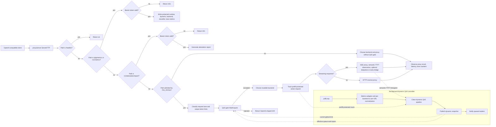
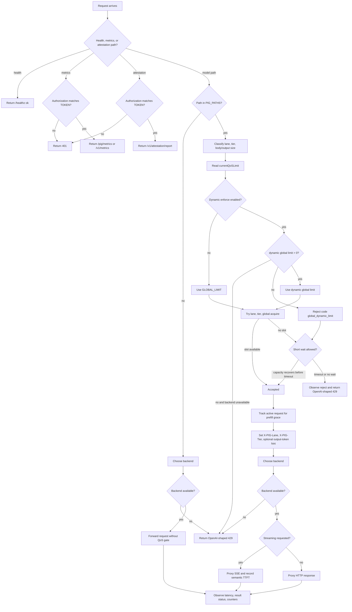
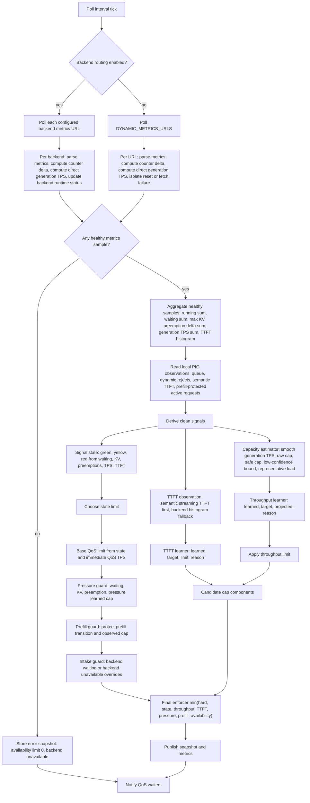
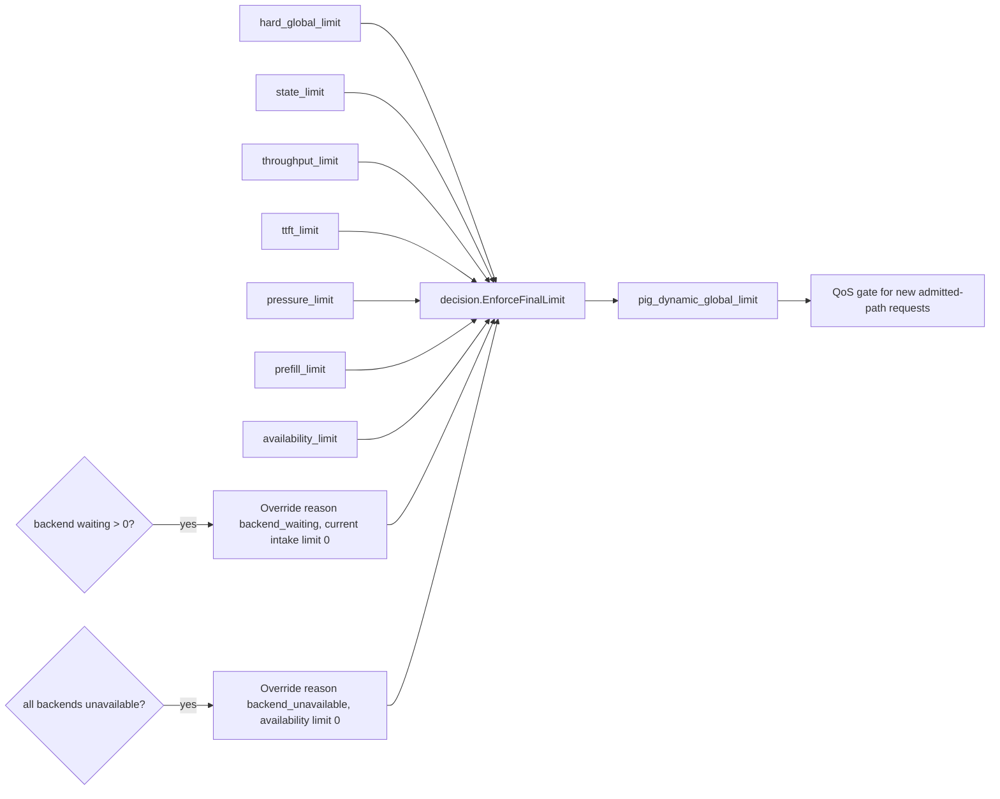

# PIG Internal Component Algorithm Flow

This document summarizes the current PIG internal component algorithm in flowchart
form. It focuses on the runtime path from request arrival to backend forwarding,
and the background dynamic QoS loop that learns and publishes the effective
global intake limit.

## Component Topology

## Request Admission Flow

## Dynamic QoS Learning Flow

## Final Limit Composition

The final limit only controls new intake. PIG does not cancel requests that have
already been forwarded to the backend. When backend waiting is present, PIG
closes the current intake path, but the throughput learner does not overwrite
the long-term learned capacity with zero.

## Component Responsibilities

| Component | Main responsibility | Key files |
| --- | --- | --- |
| HTTP proxy server | Route health, metrics, admitted model paths, and direct proxy paths. | `internal/app/server/proxy.go`, `internal/app/server/server_setup.go` |
| Request classifier | Choose lane from body size and output-token hints. | `internal/app/request`, `internal/domain/output` |
| QoS gate | Enforce current global/tier/lane limit, short wait, and 429 rejection. | `internal/app/gate`, `internal/app/server/qos.go` |
| Dynamic controller | Poll metrics, run the clean pipeline, publish snapshots, notify waiters. | `internal/app/dynamic` |
| Metrics adapter | Normalize vLLM/SGLang metrics per backend or per static URL before aggregation. | `internal/infra/prometheus`, `internal/runtime/backend`, `internal/app/dynamic/metrics_adapter.go` |
| Telemetry aggregation | Merge backend samples and TTFT histograms with empty and single-backend fast paths. | `internal/runtime/telemetry/sample.go`, `internal/runtime/telemetry/histogram.go` |
| Clean pipeline orchestrator | Wire signal derivation, stage learners, cap application, enforcer, and final snapshot projection. | `internal/domain/dynamic/clean_pipeline.go`, `internal/domain/dynamic/clean_limit_stage.go`, `internal/domain/dynamic/snapshot_mapper.go` |
| Signal derivation | Compute generation TPS, decode running, single-user TPS, representative load, counter deltas, and prefill state. | `internal/domain/dynamic/clean_signals.go` |
| Capacity estimator | Produce smoothed TPS, raw cap, safe cap, confidence, and low-confidence bound. | `internal/domain/capacity/estimator.go` |
| Throughput learner | Learn the throughput cap upward slowly and downward quickly when evidence is representative. | `internal/domain/dynamic/clean_throughput_stage.go`, `internal/domain/capacity/clean_learning.go` |
| TTFT learner | Learn a TTFT cap from semantic TTFT or backend TTFT histograms. | `internal/domain/dynamic/clean_ttft_stage.go`, `internal/domain/latency/learning.go` |
| Pressure guard | Apply immediate protection for waiting, KV pressure, and preemptions. | `internal/domain/dynamic/clean_pressure_stage.go`, `internal/domain/capacity/pressure.go` |
| Prefill guard | Separate running from decode-running during prefill and avoid false capacity drops. | `internal/domain/dynamic/clean_prefill_stage.go`, `internal/domain/capacity/prefill.go`, `internal/runtime/prefill` |
| QoS base and cap application | Apply immediate QoS/TTFT, throughput, pressure, and prefill cap components while accumulating reasons. | `internal/domain/dynamic/clean_qos_stage.go`, `internal/domain/dynamic/clean_cap_application.go` |
| Enforcer | Compose the fixed ordered cap component list and expose the winning reason. | `internal/domain/dynamic/clean_final_enforcer.go`, `internal/domain/dynamic/clean_intake_guard.go`, `internal/domain/decision` |
| Observability | Expose protected metrics and compact status logs for every cap component. | `internal/observability/metrics`, `internal/observability/status` |

## Key Invariants

- Backend metrics are normalized before global aggregation, so one backend
  counter reset does not poison the full QoS window.
- Aggregation keeps the common single-backend poll cheap while preserving
  deterministic TTFT bucket ordering when sorting is needed.
- `generation_tps / decode_running` is the primary user-visible throughput
  signal, not total token throughput.
- `decode_running = running - prefill_protected`, so long prefill does not look
  like bad decode throughput.
- Counter deltas and prefill state are derived in small helpers before learner
  stages consume them.
- Upward learning requires representative healthy load and consecutive healthy
  windows.
- Downward protection can react quickly to low QoS, high TTFT, backend waiting,
  KV pressure, preemption, or backend unavailability.
- `waiting > 0` closes current new intake but does not force the long-term
  throughput learned capacity to zero.
- Client-facing rejects remain OpenAI-compatible `429`; internal reasons
  are exposed through protected metrics and status logs.
- Final cap composition is an ordered `min()` over hard global, state, TTFT,
  throughput, pressure, prefill, and availability components.
