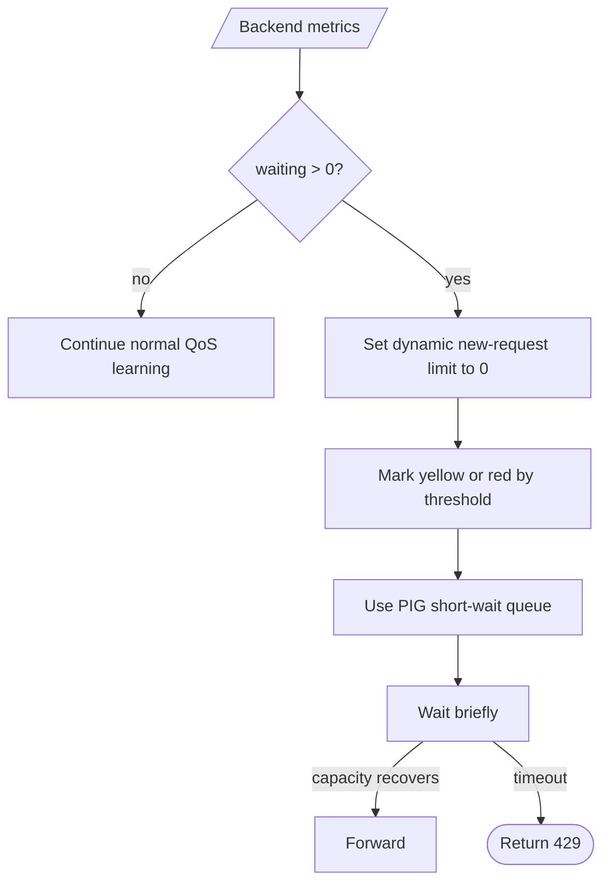

# PIG Backend Waiting Policy

This report explains how Phala Inference Guard (PIG) reacts when backend metrics
show waiting requests. It is based on the current implementation around
`PIG-v0.8.11`.

## Scope

PIG distinguishes two different queues:

- Backend waiting: requests already accepted by vLLM or SGLang but still waiting
  in the backend scheduler.
- PIG short-wait queue: requests blocked by the PIG QoS cap for a brief recovery
  window before they are forwarded or rejected.

The policy in this report is about backend waiting first, and then how that
signal affects PIG's own short-wait behavior.

## Metric Sources

PIG reads backend waiting from Prometheus metrics:

| Backend | Metric |
| --- | --- |
| vLLM | `vllm:num_requests_waiting` |
| SGLang | `sglang:num_queue_reqs` |

For multiple backends, PIG aggregates waiting across the sampled backend metrics
endpoints. Running request counts are aggregated separately, while KV cache usage
is taken as the maximum observed backend pressure.

Relevant implementation:

- `internal/infra/prometheus/sample.go`
- `internal/runtime/telemetry/sample.go`
- `internal/domain/dynamic/evaluate.go`
- `internal/app/dynamic/controller.go`
- `internal/runtime/dynamic/snapshot.go`

## Default Thresholds

The default backend waiting thresholds are intentionally low:

| Setting | Default | Effect |
| --- | ---: | --- |
| `DYNAMIC_WAITING_YELLOW` | `1` | Any backend waiting marks the load state as yellow. |
| `DYNAMIC_WAITING_RED` | `2` | Two or more backend waiting requests mark the load state as red. |

This means backend scheduler waiting is treated as an early signal that the
current cap is too open for the real request shape.

Relevant implementation:

- `internal/config/pigconfig/config_dynamic.go`
- `internal/config/pigconfig/config_validate_dynamic.go`
- `internal/domain/dynamic/evaluate.go`

## Decision Flow



## Cap Behavior

Backend waiting affects the effective QoS cap in three ways.

First, it changes the dynamic state. With default thresholds, `waiting >= 1`
adds the `waiting` reason to yellow state. `waiting >= 2` adds the same reason
to red state.

Second, it blocks upward learning. In the capacity learner, `waiting > 0` is
classified as pressure. PIG avoids probing upward while this pressure exists,
even if short-term generation throughput looks acceptable.

Third, `PIG-v0.8.11` closes new-request intake while backend waiting is present.
The dynamic global limit, pressure limit, and prefill limit are set to `0` for
new QoS intake:

```text
waiting > 0 -> dynamic limit = 0
```

That means a backend observation such as:

```text
running=80 waiting=1
```

causes newly arriving model requests to enter PIG's short-wait queue rather than
being forwarded directly to the backend. If waiting clears during the short
window, the request can proceed. If not, PIG returns an OpenAI-compatible HTTP 429.

This does not interrupt already running requests. It only limits newly arriving
requests.

Relevant implementation:

- `internal/domain/dynamic/evaluate.go`
- `internal/app/gate/gate.go`

## Pressure Memory And Recovery

When waiting appears, PIG treats it as an immediate hard intake signal rather
than a slow-learning signal. Normal capacity and TTFT learners still retain
their learned caps, but they do not probe upward while backend waiting exists.

For other pressure sources, PIG can still store a learned pressure cap inside
the dynamic QoS controller. The default pressure learning ratio is:

```text
DYNAMIC_PRESSURE_LEARN_RATIO=0.75
```

The default minimum running load for pressure learning is:

```text
DYNAMIC_PRESSURE_LEARN_MIN_RUNNING=16
```

After pressure is learned, the cap is not reset to the global cap immediately.
PIG only recovers it when all of these are true:

- backend waiting is zero
- PIG has demand pressure from its short-wait queue or fresh dynamic rejects
- generation TPS is valid
- decode running is high enough to represent real load
- observed single-user TPS is at or above the yellow target

Recovery then moves upward in small steps instead of jumping back to the full
cap.

If the learned pressure cap has already recovered to within a small tolerance
of the current base cap, and current signals are healthy, PIG treats that
pressure memory as recovered. This prevents a stale learned cap such as
`157/learned_cap` under a `159` base cap from keeping the backend state yellow
when there is no current waiting, KV pressure, preemption, or demand pressure.
Historical learned pressure caps may still participate in the final `min()`,
but they do not add `scheduler_pressure_capacity` to the state unless the cap is
actively binding current demand or an active pressure signal is present.

Relevant implementation:

- `internal/domain/capacity/pressure.go`
- `internal/domain/dynamic/clean_cap_application.go`

## PIG Short-Wait Behavior

If a new request cannot acquire QoS capacity immediately, PIG may wait briefly
before returning a 429. This short wait is intentionally capped.

Default configured wait:

```text
PIG_QUEUE_WAIT_SECONDS=0.5
```

PIG also applies an internal maximum:

```text
maxQoSQueueWait = 500ms
```

Under backend waiting or scheduler-pressure conditions, the effective wait can
shrink:

| Condition | Effective maximum wait |
| --- | ---: |
| Normal cap pressure | up to `500ms` |
| Waiting or scheduler pressure | about `250ms` |
| Red state, KV red pressure, preemption, or very high KV usage | about `100ms` |
| Backend unavailable | `0ms` |

If capacity recovers during that short window, the request is forwarded. If not,
PIG returns an OpenAI-compatible HTTP 429 response.

Relevant implementation:

- `internal/app/gate/gate.go`
- `internal/app/server/qos.go`
- `internal/infra/openai/response.go`

## Expected Runtime Pattern

When backend waiting appears, the intended behavior is:

```text
backend waiting detected
-> dynamic state becomes yellow or red
-> upward cap probing stops
-> new-request dynamic limit becomes 0
-> PIG short-wait window shrinks
-> new requests wait briefly in PIG, then enter only if waiting clears
-> persistent waiting returns fast 429
-> existing running requests continue
-> cap recovers gradually after waiting clears and TPS is healthy
```

This policy is designed to protect first-token latency and provider-facing
latency metrics. It avoids turning backend scheduler waiting into long-lived
request latency.

## Operational Signals

Use these fields in `pig_status` logs:

| Field | Meaning |
| --- | --- |
| `backend.waiting` | Backend waiting requests from vLLM or SGLang metrics. |
| `backend.state` | PIG dynamic load state plus reasons such as `yellow:waiting`. |
| `pig.limit` | Effective dynamic global limit applied to new requests. |
| `pig.pressure` | Pressure-derived cap. |
| `pig.queue` | PIG short-wait queue depth, not backend waiting. |
| `pig.reject` | PIG QoS rejections. |
| `pig.learn` | Capacity learning state, for example `pressure_hold`. |

Use these Prometheus metrics:

| Metric | Meaning |
| --- | --- |
| `pig_dynamic_observed_waiting` | Aggregated backend waiting. |
| `pig_dynamic_reason_info{reason="waiting"}` | Waiting contributed to yellow or red state. |
| `pig_dynamic_observed_ttft_source_info` | TTFT learning source: `semantic` for PIG-observed first useful SSE data, or `backend` before semantic stream samples exist. |
| `pig_dynamic_pressure_limit` | Current pressure-derived cap. |
| `pig_dynamic_pressure_learned_cap` | Stored pressure cap memory. |
| `pig_queue_current` | Current PIG short-wait queue depth. |
| `pig_queue_timeout_total` | Requests that waited briefly and then timed out. |

## Important Caveats

- Backend waiting is a strong pressure signal. In the default policy, even one
  waiting sample closes new-request intake until the next healthy poll clears
  it.
- PIG does not cancel already running backend requests when waiting appears.
- PIG's own queue is deliberately short. It is not intended to absorb sustained
  overload.
- `DYNAMIC_GLOBAL_YELLOW_LIMIT` and `DYNAMIC_GLOBAL_RED_LIMIT` default to the
  green limit. If they are not explicitly lower, state changes alone do not
  reduce the cap; pressure, TTFT, and capacity learning are what tighten it.
- For OpenRouter-style traffic, returning fast 429s under overload is preferable
  to allowing backend waiting to inflate TTFT and end-to-end latency.
